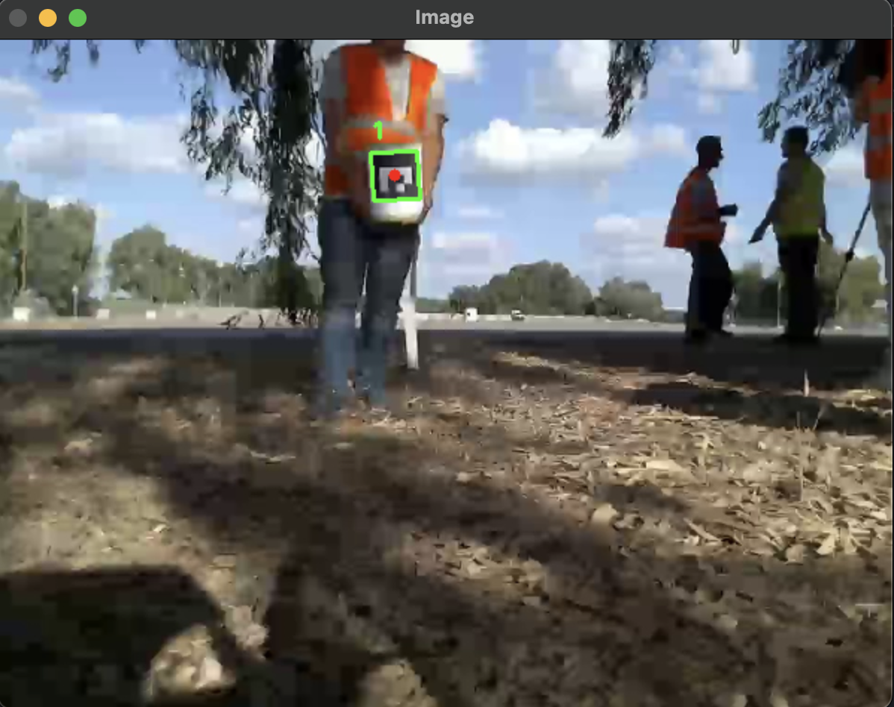

# QR Code Detection Assignment in Autonomous Robotics Course

## Description
The provided code is a Aruco code detection algorithm, which for a given video/image file, detects the aruco codes that is located within the video/image, marks the aruco code with a green rectangle with the aruco ID and writes down the 2D and 3D information for each given frame in the following format: `[Frame ID, Marker ID, Top Left, Top Right, Bottom Right, Bottom Left, Distance, Yaw, Pitch, Roll]` to a csv file located under `Out` folder.

### Explanation
- **Marker ID**: The ID of the detected ArUco marker.
- **Top Left**: Coordinates of the top left corner of the marker.
- **Top Right**: Coordinates of the top right corner of the marker.
- **Bottom Right**: Coordinates of the bottom right corner of the marker.
- **Bottom Left**: Coordinates of the bottom left corner of the marker.
- **Distance**: The distance from the camera to the marker.
- **Yaw**: The yaw angle of the marker.
- **Pitch**: The pitch angle of the marker.
- **Roll**: The roll angle of the marker.

In addition, it prints to the terminal each Aruco code that it detects with it's ID.

## Examples:
1. Running the detection on `Images/frame_1.jpg`



2. Running the detection on `Videos/challengeB.mp4`

[](https://youtu.be/sTVfOo0h26k)

## How to run
```bash
# Clone the repository
$ git clone https://github.com/MightyArty/QR-Video-Detection.git
# Enter the repository
$ cd QR-Video-Detection
# Install the libraries
$ pip install -r requirements.txt
# To run the QR-Image detection run the following
$ python detect_from_image.py --image Images/frame_1.jpg --type DICT_4X4_100
# Where "framge_1.png" can be changed to any other image containing a QR code.
# To run the QR-Video detection run the following
$ python detect_from_video.py --type DICT_4X4_100 --video Videos/challengeB.mp4
# After the run, you will see the output.csv file under the "Out" folder.
# To run the QR-Camera detection run the following
python detect_from_camera.py --type DICT_4X4_100
# After the run, you will see the camera_detect.csv file under the "Out" folder.
# To close the video/image window
$ Press "Q"
```